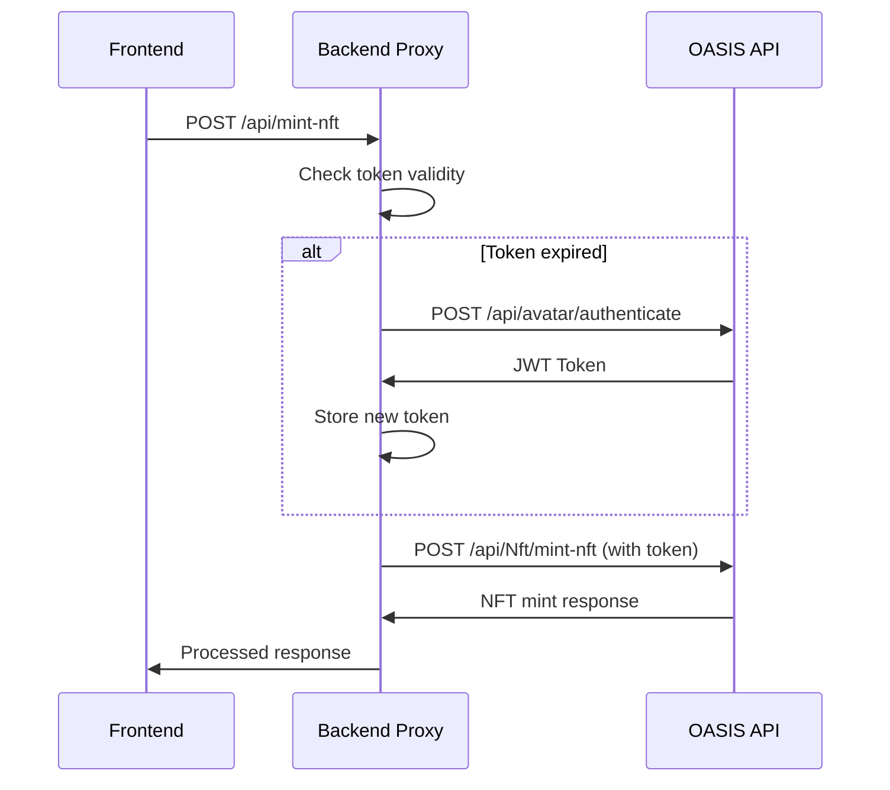

# MetaBricks Backend Proxy

This backend server acts as a proxy between the MetaBricks frontend and the OASIS API, handling authentication and NFT minting requests.

## 🚀 Quick Start

### Prerequisites
- Node.js (v14 or higher)
- OASIS API running on `https://localhost:5002`

### Installation
```bash
cd backend
npm install
```

### Configuration
Create a `.env` file (or use the default values in `config.js`):
```env
PORT=3001
OASIS_API_URL=https://localhost:5002
SITE_AVATAR_USERNAME=metabricks_admin
SITE_AVATAR_PASSWORD=Uppermall1!
```

### Running the Server
```bash
# Development mode (with auto-restart)
npm run dev

# Production mode
npm start

# Or use the startup script from project root
../start-backend.sh
```

## 🔐 Authentication System

### How Authentication Works

The backend proxy handles all OASIS API authentication automatically:

1. **Initial Authentication**: Backend authenticates with OASIS API using site avatar credentials
2. **Token Management**: JWT token is stored and automatically refreshed before expiration
3. **Frontend Simplification**: Frontend makes requests to backend (no authentication needed)
4. **SSL Handling**: Backend bypasses self-signed certificate issues with OASIS API

### Authentication Flow



### Current Authentication Status

**✅ WORKING**: Authentication system is fully operational
- **Site Avatar**: `metabricks_admin` / `Uppermall1!`
- **Token Management**: Automatic refresh implemented
- **SSL Issues**: Resolved with `rejectUnauthorized: false`
- **Fallback Method**: Curl-based authentication as backup

### Authentication Methods

#### Method 1: Axios (Primary)
```javascript
const response = await axiosInstance.post(`${OASIS_API_URL}/api/avatar/authenticate`, {
  username: SITE_AVATAR_USERNAME,
  password: SITE_AVATAR_PASSWORD
});
```

#### Method 2: Curl Fallback
```javascript
const curlCommand = `curl -s -k -X POST "${OASIS_API_URL}/api/avatar/authenticate" -H "Content-Type: application/json" -d '{"username":"${SITE_AVATAR_USERNAME}","password":"${SITE_AVATAR_PASSWORD}"}' --max-time 30 --connect-timeout 10`;
```

### Token Management

- **Expiration**: 15 minutes (configurable)
- **Refresh**: Automatic before expiration
- **Storage**: In-memory (can be extended to Redis for production)
- **Error Handling**: Automatic retry with fresh token on 401 errors

### SSL Certificate Handling

The backend is configured to handle OASIS API's self-signed certificates:

```javascript
const axiosInstance = axios.create({
  httpsAgent: new https.Agent({
    rejectUnauthorized: false,  // Bypass SSL verification
    keepAlive: true,
    timeout: 30000
  }),
  timeout: 30000,
  headers: {
    'User-Agent': 'MetaBricks-Backend/1.0',
    'Connection': 'keep-alive'
  }
});
```

## 🔧 How It Works

### Authentication Flow
1. Backend authenticates with OASIS API using site avatar credentials
2. Stores JWT token and manages automatic refresh
3. Frontend makes requests to backend (no authentication needed)

### API Endpoints

#### Health Check
```
GET /health
```
Returns server status and authentication state.

#### NFT Minting
```
POST /api/mint-nft
```
Mints an NFT via OASIS API. Request body:
```json
{
  "walletAddress": "0x...",
  "brickId": 1,
  "brickName": "MetaBrick #1",
  "brickType": "regular",
  "metadataUrl": "https://...",
  "imageUrl": "https://...",
  "perks": [],
  "rarity": "common"
}
```

## 🎯 Benefits

- ✅ **Unlimited Users**: No rate limiting from single avatar
- ✅ **Secure**: Credentials never exposed to frontend
- ✅ **Reliable**: Automatic token refresh and error handling
- ✅ **Simple**: Frontend just changes API endpoint
- ✅ **Scalable**: Can be deployed to any cloud platform

## 🐛 Troubleshooting

### Backend won't start
- Check if port 3001 is available
- Ensure OASIS API is running on port 5002
- Verify credentials in config

### Authentication fails
- Check OASIS API is accessible
- Verify site avatar credentials
- Check network connectivity

### NFT minting fails
- Check backend logs for detailed error messages
- Verify OASIS API is responding
- Check request payload format

## 📊 Monitoring

The backend provides detailed logging:
- 🔐 Authentication events
- 📡 API requests and responses
- ❌ Error handling and retries
- 🎯 NFT minting success/failure

Check the console output for real-time status.
